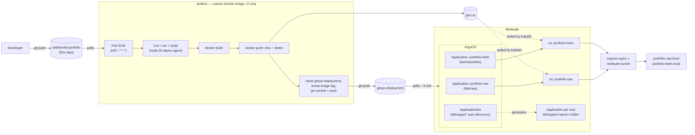

# Siddhartha Sanapala — Portfolio

A personal portfolio site for Siddhartha Sanapala (Platform/DevOps Engineer), built as a
production-style Next.js application with a Gemini-powered AI assistant, and deployed two ways:
a simple single-container Docker setup, and a full enterprise-style GitOps CI/CD pipeline
(Jenkins → GHCR → ArgoCD → Kubernetes) built entirely on free/local infrastructure for learning
purposes.

This repository is the **application repo**. A second, separate repository —
[`gitops-deployment`](https://github.com/Siddharthasanapala/gitops-deployment) — holds the
Kubernetes/Helm/ArgoCD deployment manifests. Why two repos and how they fit together is explained
in [Deployment → Two-Repo GitOps Strategy](#two-repo-gitops-strategy) below.

---

## Table of contents

1. [Overview](#overview)
2. [Tech stack](#tech-stack)
3. [Application architecture](#application-architecture)
4. [Repository structure](#repository-structure)
5. [Getting started (local development)](#getting-started-local-development)
6. [Environment variables](#environment-variables)
7. [Deployment — simple (Docker Compose)](#deployment--simple-docker-compose)
8. [Deployment — enterprise CI/CD (Kubernetes + Jenkins + ArgoCD + Helm)](#deployment--enterprise-cicd-kubernetes--jenkins--argocd--helm)
9. [Hard rules / non-negotiables](#hard-rules--non-negotiables)
10. [Documentation index](#documentation-index)

---

## Overview

- **What it is**: a single-page portfolio (Hero, Engineering Principles, Skills, Experience,
  Projects, Timeline, Education, Certifications, Contact) plus an embedded AI chatbot ("Sid's
  Assistant") that answers visitor questions about Siddhartha's professional background and can
  take a message on his behalf.
- **What makes it more than a static site**: the chatbot is backed by Google's Gemini API with a
  strict, verbatim system prompt and a structured `RESUME_CONTEXT` built fresh from this repo's
  own `/data/*.ts` files on every request — it can only state facts that are actually in those
  files, and it can route a visitor's message to a real email via Resend after an explicit
  confirmation step.
- **What makes the deployment side interesting**: rather than a single `docker run` and calling
  it done, this project also implements a second, parallel deployment path that mirrors how a real
  platform team ships software — Jenkins builds and tests the app and pushes a container image,
  a separate GitOps repository holds the desired Kubernetes state, and ArgoCD continuously
  reconciles a local Kubernetes cluster (Minikube) against that repository. See
  [§8](#deployment--enterprise-cicd-kubernetes--jenkins--argocd--helm) for the full picture.

---

## Tech stack

### Application

| Layer | Technology |
|---|---|
| Framework | [Next.js 16](https://nextjs.org) (App Router, React Server Components, `output: 'standalone'`) |
| UI library | React 19 |
| Language | TypeScript (strict mode) |
| Styling | Tailwind CSS v4 (token-driven design system, dark/light themes only) |
| Animation | Framer Motion 12, loaded via `LazyMotion`/`m.*` so the animation engine code-splits into its own chunk |
| Icons | lucide-react |
| AI / chatbot | Google Gemini API (`@google/generative-ai`), model `gemini-flash-lite-latest`, function-calling for the contact flow |
| Email delivery | [Resend](https://resend.com) SDK (contact-flow messages only — no direct mailto/contact form anywhere on the site) |
| Validation | Zod (API request schemas) |
| Rate limiting | Custom in-memory sliding-window limiter (`lib/rateLimit.ts`) |
| Fonts | `next/font` — Space Grotesk, Inter, JetBrains Mono |

### Simple deployment (this repo)

| Layer | Technology |
|---|---|
| Container | Docker, multi-stage build (`deps` → `builder` → `runner`), non-root user, `HEALTHCHECK` against `/api/health` |
| Orchestration (local) | Docker Compose (`portfolio` service + optional `caddy` reverse-proxy service for real deployments) |
| Reverse proxy / TLS | [Caddy](https://caddyserver.com) (automatic HTTPS via Let's Encrypt — for real deployments only, omitted for local dev) |

### Enterprise CI/CD deployment (this repo + `gitops-deployment`)

| Layer | Technology |
|---|---|
| Cluster | [Minikube](https://minikube.sigs.k8s.io) (`docker` driver), `ingress-nginx` + `metrics-server` addons |
| CI | [Jenkins](https://www.jenkins.io), running as a custom Docker image (`jenkins/jenkins:lts` + Docker CLI for Docker-outside-of-Docker builds), plugins baked in via `jenkins-plugin-cli`, admin bootstrapped via a Groovy init script — no manual setup wizard |
| Container registry | [GitHub Container Registry](https://ghcr.io) (`ghcr.io`) |
| CD | [ArgoCD](https://argo-cd.readthedocs.io) — pull-based GitOps, `Application` objects with `automated: {prune, selfHeal}` sync policy |
| Auto-discovery of new apps | ArgoCD `ApplicationSet` with a Git directory generator (drop a new folder in the GitOps repo, get a live Application automatically) |
| Packaging | Both plain Kubernetes YAML **and** a parametrized [Helm](https://helm.sh) chart of the same app, deployed side by side, for comparison/learning |
| Ingress | `ingress-nginx` + `minikube tunnel`, reached via local hostnames (`portfolio-raw.local`, `portfolio-helm.local`) |
| Secrets | Created imperatively per-namespace (`kubectl create secret ... --from-env-file`) — never committed in plaintext to the GitOps repo |

---

## Application architecture

```
app/
├── layout.tsx            Root layout — metadata, JSON-LD Person schema, MotionProvider, ThemeProvider
├── page.tsx               Composes every section in order (Hero → Principles → Skills → … → Contact)
├── globals.css            Design tokens (CSS custom properties) for both themes
├── opengraph-image.tsx     next/og-generated OG card (no static asset needed)
├── robots.ts / sitemap.ts  Next.js file-convention SEO routes
└── api/
    ├── chat/route.ts       Chatbot endpoint — injects the verbatim system prompt + live
    │                       RESUME_CONTEXT (rebuilt from /data on every request), calls Gemini,
    │                       rate-limited, sanitizes input, never leaks the API key or prompt
    ├── contact/route.ts     Validates (Zod) + honeypot + rate-limits, sends via Resend
    └── health/route.ts      Liveness/readiness endpoint — used by Docker HEALTHCHECK *and* by
                              the Kubernetes readiness/liveness probes in the enterprise deployment

components/
├── hero/, principles/, skills/, experience/, projects/, timeline/, education/, contact/
│                          One folder per portfolio section, each reading its content from /data
├── chatbot/                ChatWidget, ChatLauncher, ChatMessage, ContactForm — the assistant UI
├── nav/                    Scroll-spy nav with animated underline (desktop) / slide-in panel (mobile)
├── theme/                  ThemeProvider (hydration-safe dark/light toggle), MotionProvider
└── ui/                     Shared primitives — Section, Card, Badge, Button, Container, Reveal, …

data/                       The Content Bank — every fact rendered on the site AND fed to the
                             chatbot's RESUME_CONTEXT lives here (profile, principles, skills,
                             experience, projects, timeline, education, certifications). Nothing
                             the chatbot says is ever hardcoded anywhere else.

lib/
├── gemini.ts                Calls the Gemini API with function-calling for the contact flow
├── systemPrompt.ts           The verbatim chatbot system prompt template
├── resumeContext.ts          Builds RESUME_CONTEXT fresh from /data on every call (no caching —
│                             an earlier per-process cache was a real bug: it meant content
│                             updates never reached the chatbot without a full restart)
├── rateLimit.ts              In-memory sliding-window limiter (single-instance only — see the
│                             note in the Kubernetes Deployment about not scaling replicas
│                             without also moving this to a shared store)
├── email.ts, sanitize.ts     Resend wrapper, input sanitization
└── motion.ts / motionFeatures.ts / useIsReducedMotion.ts   Shared Framer Motion variants and
                             hydration-safe reduced-motion handling
```

**Chatbot data flow**: visitor message → `/api/chat` → sanitize + rate-limit → `gemini.ts` builds
the system prompt fresh from `/data/*.ts` (via `resumeContext.ts` + `systemPrompt.ts`) → Gemini
responds, either with text or a `send_message` function call → on explicit visitor confirmation,
the function call is forwarded to `/api/contact` → Resend delivers a real email. The chatbot can
only ever state facts present in that structured JSON — no invented skills, dates, employers, or
metrics, and no phone number/WhatsApp under any phrasing.

---

## Repository structure

This project deliberately spans **two Git repositories**, which is also the core lesson of the
enterprise deployment side of this project (GitOps separation of concerns):

| Repo | Purpose | Contains |
|---|---|---|
| **`siddhartha-portfolio`** (this repo) | Application source | Next.js app, `Dockerfile`, `Jenkinsfile`, the Jenkins controller's own image definition (`jenkins/`), the four build/roadmap spec docs |
| **[`gitops-deployment`](https://github.com/Siddharthasanapala/gitops-deployment)** | Deployment desired-state | Plain Kubernetes YAML (`k8s/raw/`), the Helm chart (`helm/portfolio/`), ArgoCD `Application`/`ApplicationSet` objects (`argocd/`), and the full deployment plan (`DEPLOYMENT.md`) |

Jenkins watches **this** repo and reacts to code changes; it never touches the cluster directly.
ArgoCD watches **only** `gitops-deployment` and reconciles the cluster; it has no idea Jenkins
exists. The only link between the two loops is a git commit — Jenkins, after building and pushing
an image, clones `gitops-deployment`, bumps the image tag, and pushes. See
[§8](#deployment--enterprise-cicd-kubernetes--jenkins--argocd--helm) for the full diagram.

---

## Getting started (local development)

```bash
npm install
cp .env.local.example .env.local   # fill in GEMINI_API_KEY at minimum for the chatbot to work
npm run dev
```

Open [http://localhost:3000](http://localhost:3000). The chatbot and contact flow need real
`GEMINI_API_KEY` / `RESEND_API_KEY` values to function; everything else renders from `/data` with
no external dependencies.

```bash
npm run lint        # ESLint
npx tsc --noEmit     # TypeScript strict-mode check
npm run build        # production build (same one Docker/Jenkins run)
```

---

## Environment variables

| Variable | Required | Purpose |
|---|---|---|
| `GEMINI_API_KEY` | Yes | Google AI Studio key for the chatbot |
| `RESEND_API_KEY` | Yes | Resend API key for the contact flow email |
| `CONTACT_EMAIL` | Yes | Where confirmed contact-flow messages are delivered |
| `SITE_URL` | Yes | Canonical URL, used for metadata/OG/sitemap (server-only, not baked into the client bundle) |
| `SMTP_HOST` / `SMTP_PORT` / `SMTP_USER` / `SMTP_PASS` | Optional | Alternate SMTP-based email path, if not using Resend directly |
| `NODE_ENV` | Set by the environment | Standard Next.js production/development switch |

See `.env.example` / `.env.local.example` for the exact template. **Never commit `.env`** — it's
gitignored, and this same rule holds all the way through to Kubernetes: real values are always
supplied at runtime (via `.env` for Compose, via `kubectl create secret` for Kubernetes), never
baked into an image or committed anywhere, including the GitOps repo.

---

## Deployment — simple (Docker Compose)

```bash
docker compose build
docker compose up -d portfolio      # app only, port 3000
# add the `caddy` service too only once Caddyfile has a real domain — see below
```

- `Dockerfile`: 3-stage build (`deps` → `builder` → `runner`), runs as a non-root user, exposes
  `3000`, `HEALTHCHECK` hits `/api/health`.
- `docker-compose.yml`: the `portfolio` service is safe to run standalone for local testing; the
  `caddy` service provides automatic HTTPS for a real deployment but requires a real domain in
  `Caddyfile` first — running it locally against the placeholder domain will just generate failed
  ACME certificate requests.
- Image size ≈250MB, verified secret-free (`docker history <image>` shows no baked-in credentials).

This path is enough to run the site anywhere Docker runs — a VPS, Fly.io, Railway, Render, Cloud
Run, ECS, etc. Real hosting, DNS, and TLS provisioning are outside this repo's scope (they're the
operator's own infrastructure choices).

---

## Deployment — enterprise CI/CD (Kubernetes + Jenkins + ArgoCD + Helm)

The full, phase-by-phase build log for this lives in
[`gitops-deploy/DEPLOYMENT.md`](gitops-deploy/DEPLOYMENT.md) (kept in this repo purely as the
planning document; the actual manifests it describes live in the separate `gitops-deployment`
repo — see [Repository structure](#repository-structure)). This section is the summary.

### The fully automated flow



Two independent loops, connected only by a git commit — this split (not a single script running
`kubectl apply`) is the actual point of GitOps:

- **CI (push-based)**: Jenkins polls this repo, and on a change: installs deps, lints, type-checks,
  builds, builds a Docker image tagged with both the git SHA and `:latest`, pushes both to GHCR,
  then makes a *second* commit to the *separate* `gitops-deployment` repo bumping the image tag.
  Jenkins never touches the cluster.
- **CD (pull-based)**: ArgoCD independently polls `gitops-deployment` (~3 min interval) and
  reconciles the live cluster against it. It has no knowledge of Jenkins, GHCR, or the app repo.

### What's actually deployed, twice, for comparison

| | `k8s/raw/` | `helm/portfolio/` |
|---|---|---|
| Format | Plain Kubernetes YAML | Parametrized Helm chart |
| ArgoCD Application | `portfolio-raw` | `portfolio-helm` |
| Namespace | `portfolio-raw` | `portfolio-helm` |
| Reachable at | `http://portfolio-raw.local` | `http://portfolio-helm.local` |

Both are the exact same application/image, deployed two different ways side by side, deliberately
kept in separate namespaces so their ArgoCD `Applications` never fight over the same objects.

### Auto-discovery of new apps (ApplicationSet)

A single `Application` object per app only exists because it was `kubectl apply`'d once by hand.
The `portfolio-apps` **ApplicationSet** (`gitops-deployment/argocd/applicationset-apps.yaml`) uses
a Git directory generator over `k8s/apps/*`: drop a new folder of plain Kubernetes manifests there,
push, and a brand-new `Application` — namespace, sync policy, and all — appears in ArgoCD entirely
on its own, no `kubectl` involved. Removing the folder prunes it just as automatically.

### Secrets

Real credentials (`GEMINI_API_KEY`, `RESEND_API_KEY`, SMTP vars, etc.) are **never** committed to
`gitops-deployment`, even as "example" values with real data. Each namespace gets its Secret
created directly against the cluster:

```bash
kubectl create secret generic portfolio-secrets -n <namespace> --from-env-file=.env
```

`k8s/raw/secret.example.yaml` is a shape-only reference (placeholder values) and is explicitly
excluded from what ArgoCD syncs (`directory.exclude` on the `Application`) — otherwise ArgoCD's
self-heal would overwrite the real Secret with placeholders.

### Running it yourself

Full step-by-step instructions (Minikube flags, registry setup, the exact Dockerfile/Jenkinsfile
content, every bottleneck hit and how it was fixed — port conflicts, the ArgoCD CRD size limit,
the Docker-outside-of-Docker socket-group workaround, etc.) are in
[`gitops-deploy/DEPLOYMENT.md`](gitops-deploy/DEPLOYMENT.md). It's written as a phase-by-phase plan
with an explicit "Done when" for each phase, plus a dedicated bottlenecks/edge-cases section
(§7) covering everything that actually went wrong while building this out — most useful read for
anyone reproducing this setup.

---

## Hard rules / non-negotiables

These hold across every layer of this project — the site, the chatbot, and both deployment paths:

- Only an email address is ever shown as contact info. **No phone number, no WhatsApp, anywhere**
  — including metadata, JSON-LD, and the chatbot.
- No direct mailto/contact form. The chatbot's confirmed "leave a message" flow is the only way a
  visitor can reach Siddhartha.
- Two themes only (dark default, light), token-driven — no ad-hoc colors.
- Every fact the site or chatbot states must trace to `data/*.ts` or the actual resume — nothing
  invented.
- No secrets in client code or baked into any Docker image, at any layer — runtime env vars /
  Kubernetes Secrets only, always created out-of-band from git.

---

## Documentation index

| Doc | Covers |
|---|---|
| [`01-PORTFOLIO_BUILD_SPEC.md`](plan/01-PORTFOLIO_BUILD_SPEC.md) | Design system, content bank, hard rules, acceptance checklist |
| [`02-IMPLEMENTATION_ROADMAP.md`](plan/02-IMPLEMENTATION_ROADMAP.md) | The phase-by-phase build order for the application itself (Phases 0–6 + sign-off) |
| [`03-CHATBOT_SYSTEM_PROMPT.md`](plan/03-CHATBOT_SYSTEM_PROMPT.md) | The chatbot's full behavior spec, verbatim system prompt, QA checklist |
| [`04-DOCKER_DEPLOYMENT.md`](plan/04-DOCKER_DEPLOYMENT.md) | The simple single-container Docker deployment target |
| [`gitops-deploy/DEPLOYMENT.md`](gitops-deploy/DEPLOYMENT.md) | The full enterprise CI/CD deployment plan (Minikube, Jenkins, ArgoCD, Helm) — phase-by-phase, with a dedicated bottlenecks/edge-cases section |
| [`CLAUDE.md`](CLAUDE.md) | Running session log of what's been built and verified, phase by phase |
